# FinanCare - POS, eOrder & More by Rilind Kyçyku

### Logo


Projekti është i tipit Shitje dhe Kontabilitet.

Ky projekt është i punuar në:

- **React JS** - Frontend
- **ASP.NET Core** - Backend
- **MSSQL** – Database

# Informata rreth Funksioneve, Konfigurimit dhe Pamjes

## Funksionet

- Authentikimi bëhet përmes JWToken.
- **Eksportimi i të Dhënave** - Eksportimi i të dhënave është i mundur në të gjitha faqet ku gjenden tabela. Eksportimi lejohet në formate të ndryshme si: Excel, JSON, CSV, Tekst etj.
- **Tabelat** - Secila tabelë është e konfiguruar në atë mënyrë që të mundësojë filtrimin e të dhënave pas kërkimit, apo të bëjë renditjen e tyre sipas të gjitha kolonave në tabelë.
- **Fatura** - Secila porosi ka të mundur shfaqjen, ruajtjen dhe printimin e faturës për atë porosi, gjithashtu gjatë blerjes me POS fatura shfaqet gjithmonë pas mbylljes së Paragonit.
- **Barcode** - Secila faturë ka të vendosur Barcode i cili përmban numrin e faturës.
- **Statistikat** - Kjo është një faqe e dedikuar vetëm për statistikat e Dyqanit e cila ka qasje vetëm Roli i Admin. Në këtë faqe gjenden statistika të ndryshme për shitje, produkte dhe klientë.
- **Zbritjet e Produktit** - Zbritjet mundësohen për të gjitha produktet dhe mund të vendosen sipas datave të ndryshme.
- **Të dhënat e Biznesit** - Këtu mund të vendosen të dhënat e biznesit si Emri i Biznesit, Numri Unik, TVSH etj., Logo si dhe informatat bankare të cilat shfaqen tek pjesa e faturës.
- **Atributi isDeleted** - Me këtë atribut mundësohet që gjatë largimit të produkteve, kategorive, kompanive etj. nga sistemi ato në të vërtetë nuk fshihen por mbeten në databazë, por nuk shfaqen tek klienti. Kjo është bërë që të mos ketë probleme pas largimit dhe të mos ndryshohen faturat e statistikat.
- **Menaxhimi i Borxheve - POS** - Çdo klient që posedon bonus kartelë në sistem ka mundësi që gjatë pagesës të marrë borxh, gjë që sistemi bën kalkulimin automatik të tij.
- **Çmimorja** - Çmimorja është aktive për printim gjatë kalkulimit si dhe zbritjeve.
- **Kartelat Financiare** - Kartelat financiare janë të mundura për cilin do partner që është i vendosur në sistem.
- **Kartelat e Artikullit** - Secili artikull posedon kartela të cilat përmbajnë informatat kyçe për produktin.

## Konfigurimi

Së pari duhet të bëhet konfigurimi i Connection String në `FinanCare/appsettings.json` dhe duhet të ndërrohet emri i Server me atë të serverit tuaj. Pastaj ju duhet të bëni run komandën **EntityFrameworkCore\update-database** në **Serverin e Projektit - FinanCare**, e cila do të mundësojë gjenerimin në tërësi të databazës dhe insertimin e të dhënave bazike.

### **Njoftimi për Ndryshimin e Serverit të API dhe Front**
API i cili vjen nga ASP.NET Core mund të ndryshohet duke vendosur adresën IP në file-in `.env` që gjendet në folderin `financare`. Adresa IP mund të gjendet duke ekzekutuar komandën `ipconfig` në Command Prompt (CMD).  
- **Hapi 1**: Hapni CMD dhe shkruani:
```ipconfig```
Kërkoni nën seksionin "IPv4 Address" (p.sh., `192.168.0.102`).  
- **Hapi 2**: Në file-in `.env`, shtoni ose përditësoni rreshtin:
```VITE_API_BASE_URL=http://192.168.0.102:7285```
```VITE_BASE_URL=http://192.168.0.102:5173```
- **Shënim**: Zëvendësoni `192.168.0.102` me adresën tuaj IP dhe `7285 dhe 5173 (Front)` me portin e konfiguruar për API-n tuaj (```7285 dhe 5173``` janë të konfiguruar automatikisht).

### **Konfigurimi i Certifikatës HTTPS**
Për të shmangur problemet gjatë përdorimit të HTTPS, duhet të krijohet dhe të besohet një certifikatë zhvillimi.  
- **Hapi 1**: Hapni PowerShell si Administrator.  
- **Hapi 2**: Ekzekutoni komandën:
```dotnet dev-certs https --trust```
- **Rezultati**: Do të shihni një mesazh konfirmimi dhe certifikata HTTPS do të regjistrohet në sistemin tuaj për komunikim të sigurt gjatë zhvillimit.  

Pasi të keni përfunduar me këto hapa, ju duhet të bëni **run** serverin dhe pastaj në Visual Studio Code, pjesën e React që gjendet tek **financare**, duhet të hapet në terminal. Më pas duhen të bëhen run këto komanda:

- **npm i** - Bën instalimin automatik të paketave të nevojshme.
- **npm run build** - Bën Build Projektin.  
_Këto duhen të bëhen vetëm nëse e keni hapur projektin për herë të parë._
- **npm run dev** - Bën startimin e projektit. (_Kjo duhet të bëhet gjithmonë kur startojmë projektin e Vite._)

Pasi të bëhet konfigurimi, ju mund të kyçeni me këto të dhëna:

| **Email**                               | **Password**               | **Aksesi**            |
|-----------------------------------------|----------------------------|-----------------------|
| financa.financa@financare.com           | financafinanca1@           | Financa               |
| mbeshtetje.klientit@financare.com       | mbeshtetjeklientit1@       | Mbështetje e Klientit |
| qmimore.qmimore@financare.com           | qmimoreqmimore1@           | Çmimore               |
| faturist.faturist@financare.com         | faturistfaturist1@         | Faturist              |
| kalkulant.kalkulant@financare.com       | kalkulantkalkulant1@       | Kalkulant             |
| menaxher.menaxher@financare.com         | menaxhermenaxher1@         | Menaxher              |
| komercialist.komercialist@financare.com | komercialistkomercialist1@ | Komercialist          |
| arkatar.arkatar@financare.com           | arkatararkatar1@           | Arkatar               |
| burime.njerzore@financare.com           | burimenjerzore1@           | Burime Njerzore       |
| puntor.thjeshte@financare.com           | puntorthjeshte1@           | Puntor i Thjeshtë     |

## Informata të tjera

Në rast se dëshironi të përdorni të dhënat e FinanCare, ato mund t’i gjeni në file-in që gjendet në folderin **Databaza** me emrin **FinanCareDB.sql**. Këtë file duhet ta bëni execute në **SQL Server** pasi të keni bërë konfigurimet paraprake.

## Pamja e FinanCare

### Login

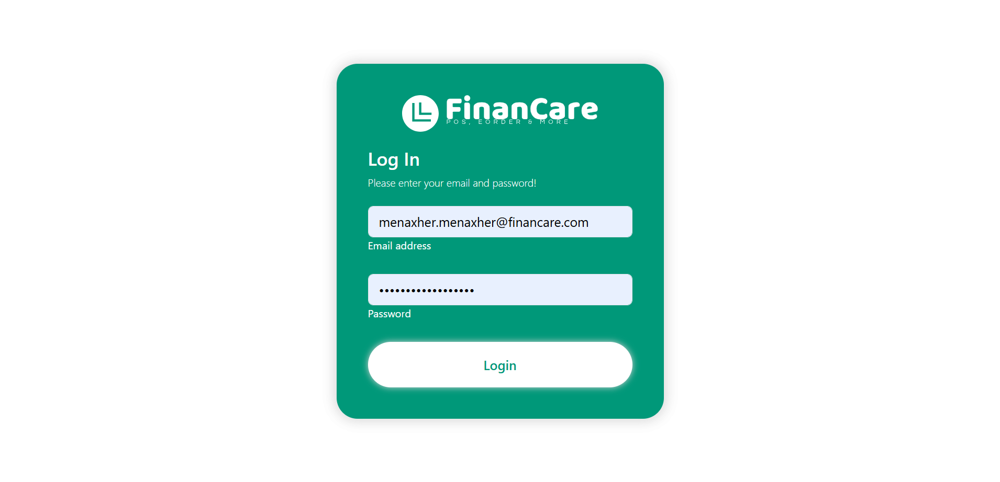

### Dashboard

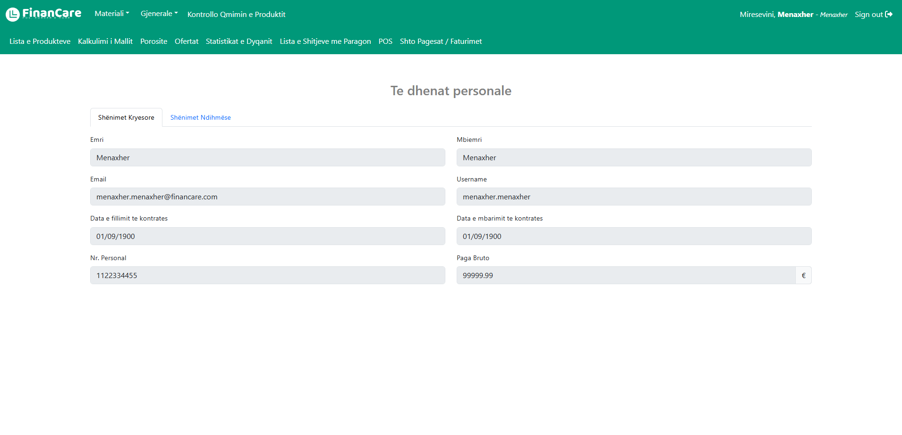

### Tabela

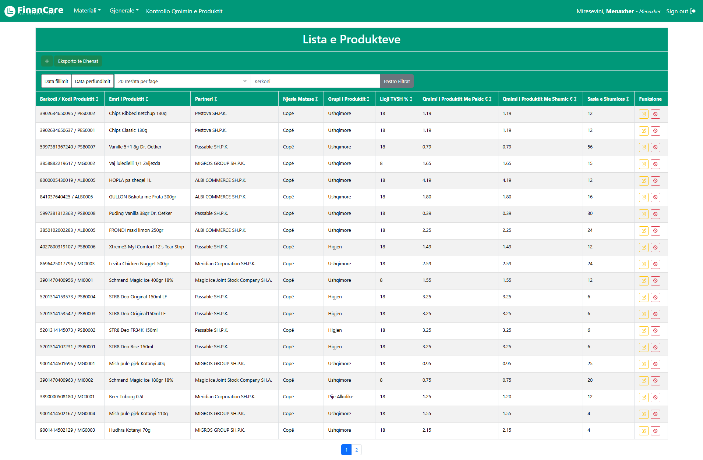

### Eksportimi të Dhënave

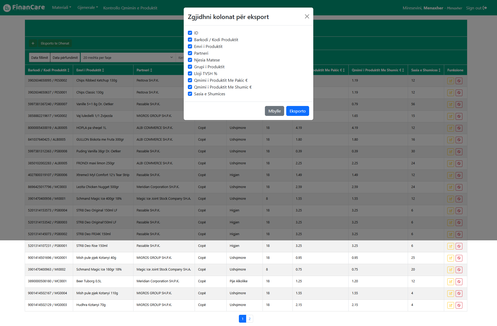

### Eksportimi të Dhënave - EXCEL

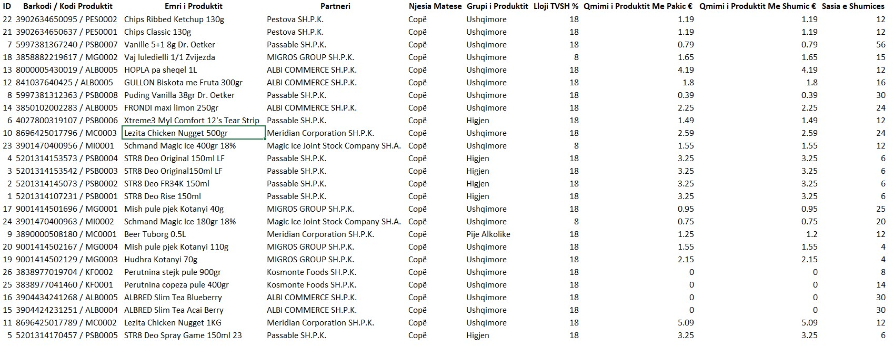

### Kartela e Artikullit

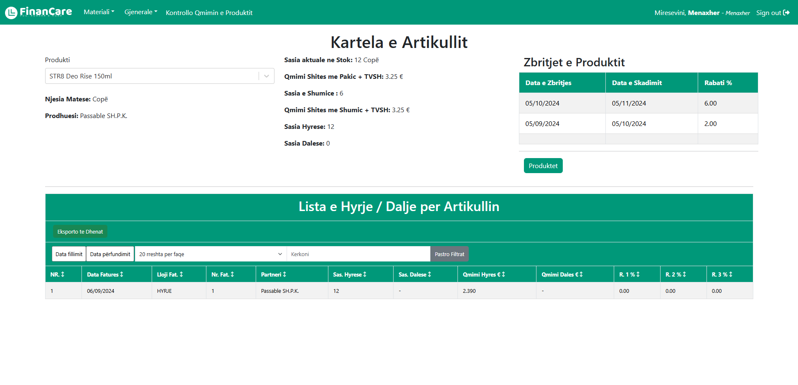

### Kartela Financiare

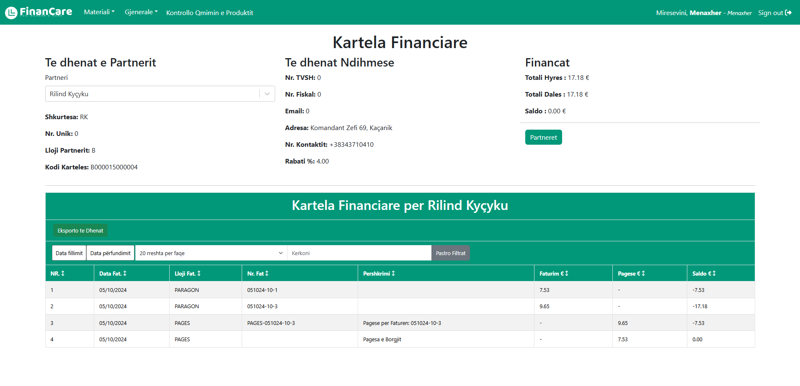

### Kontrollimi Çmimeve

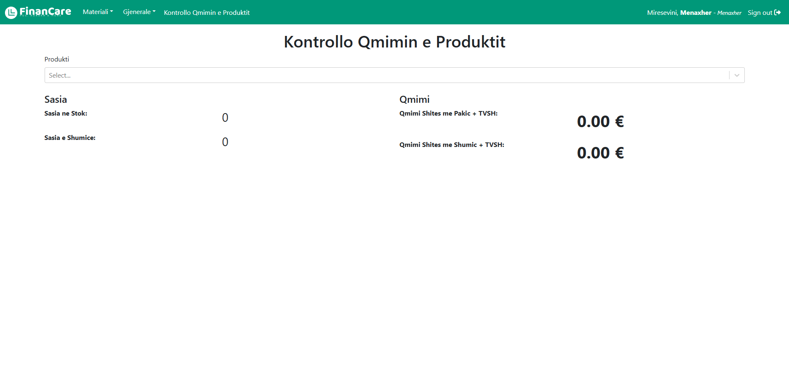

### Fatura

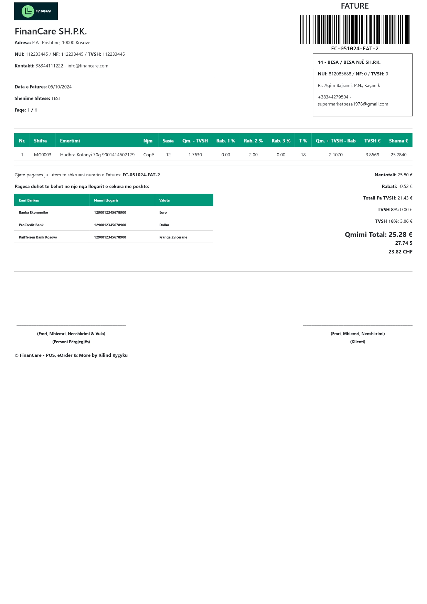

### Paragon

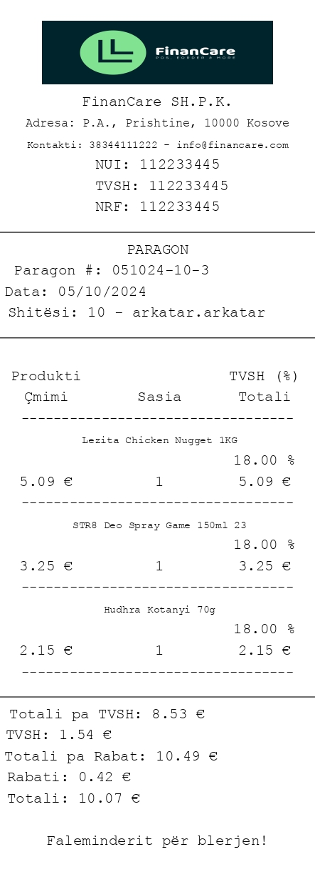

### Pagesat e Faturës

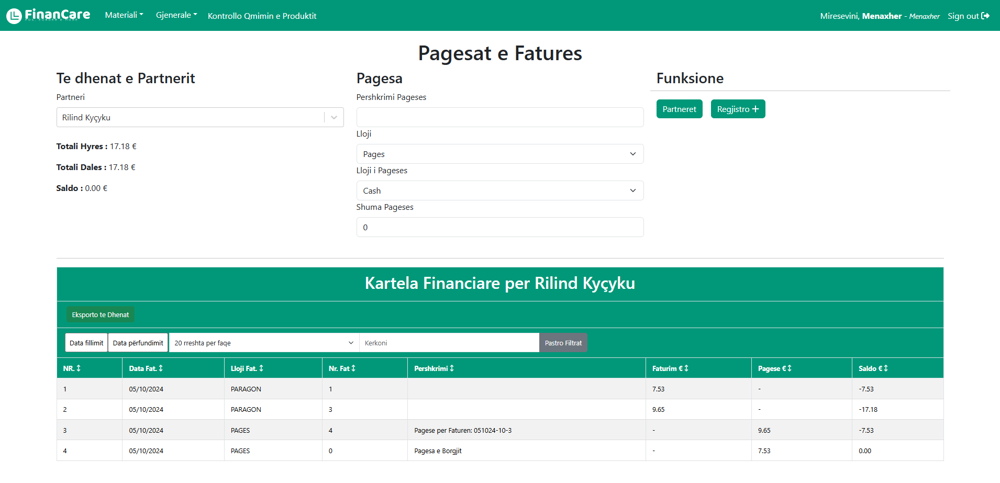

### POS

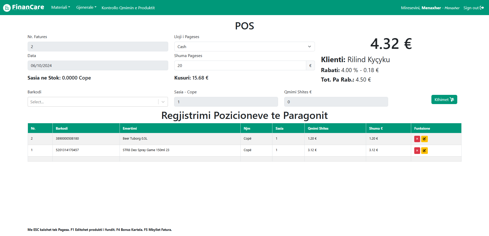

### Çmimorja

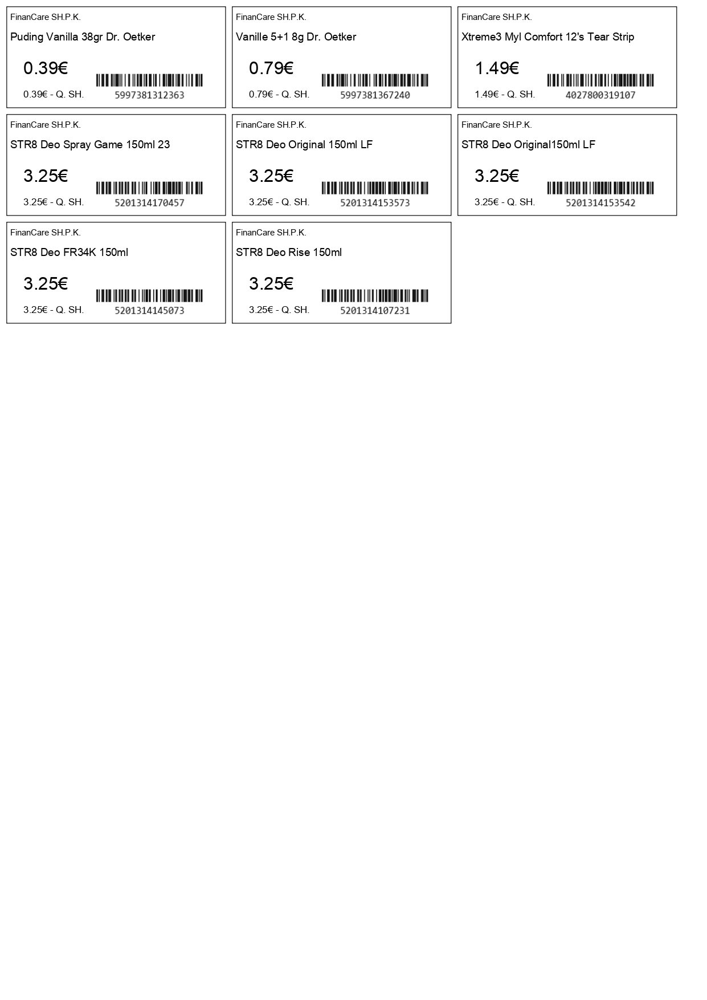

### Çmimorja Zbritjes

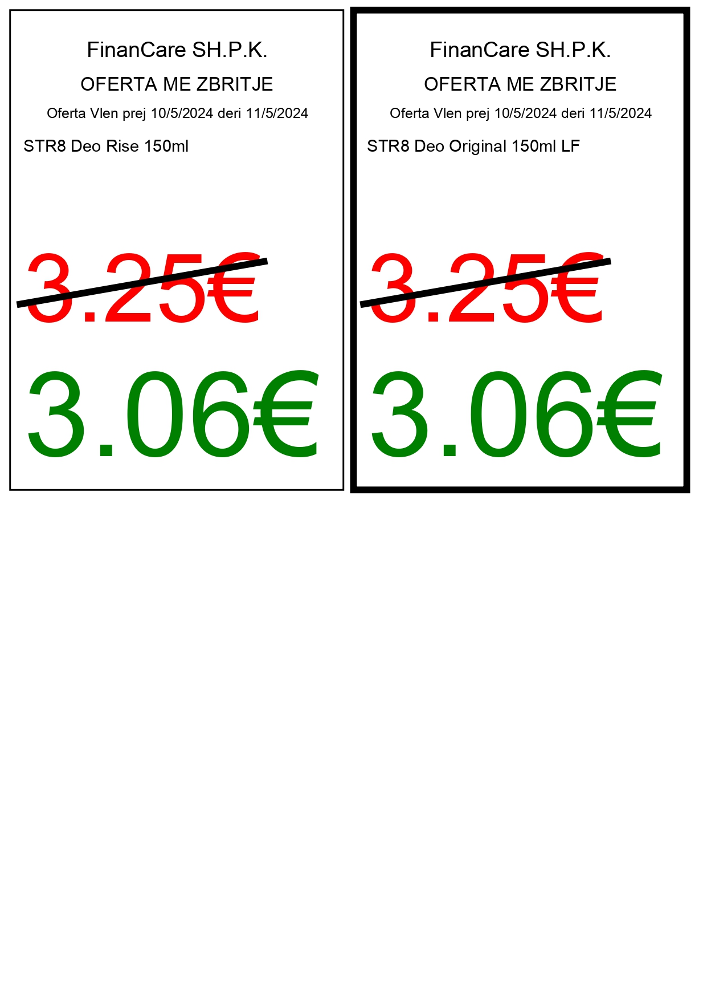

### Statistikat

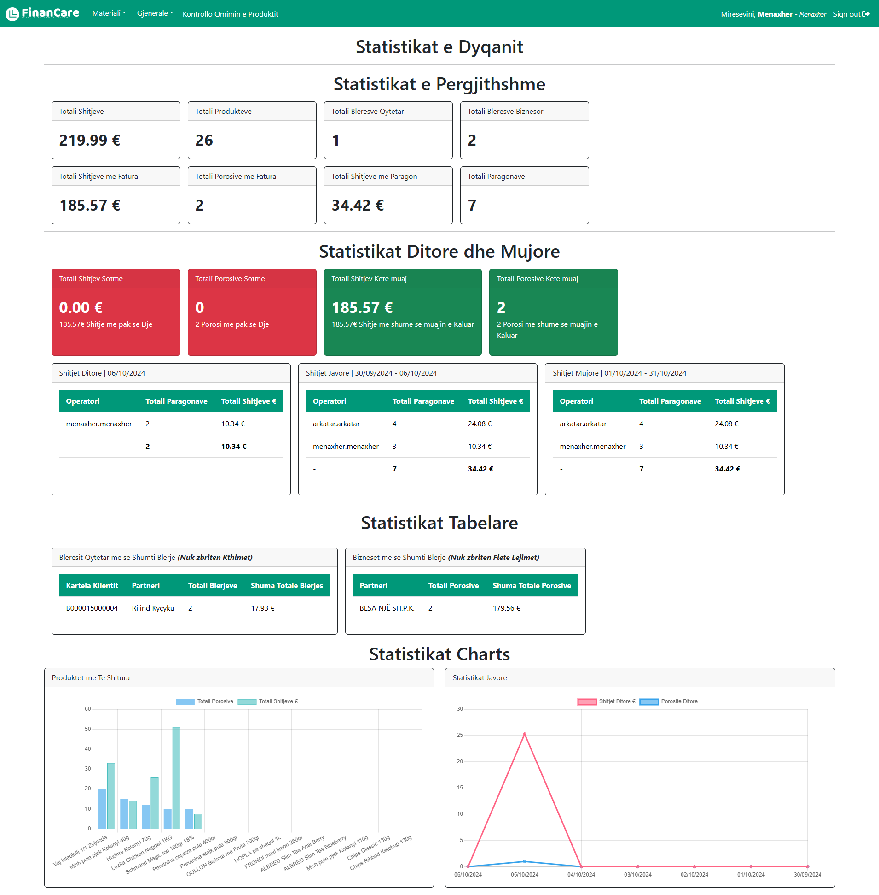
